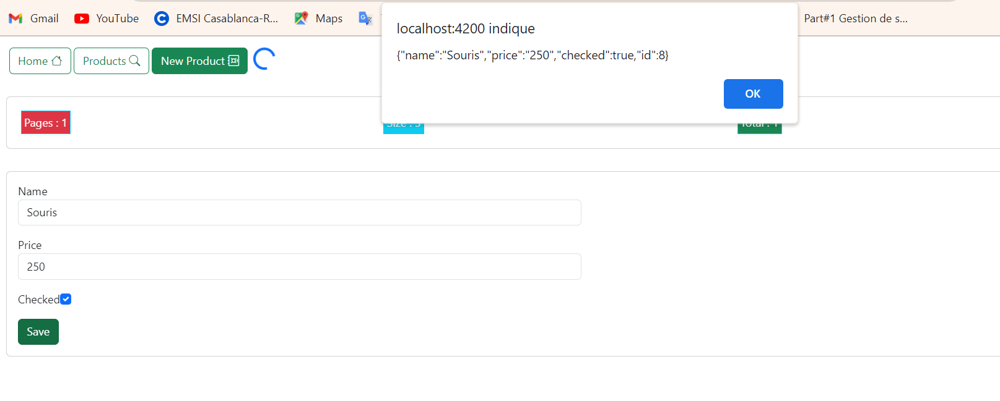
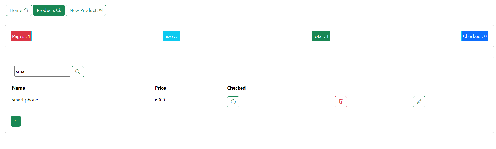
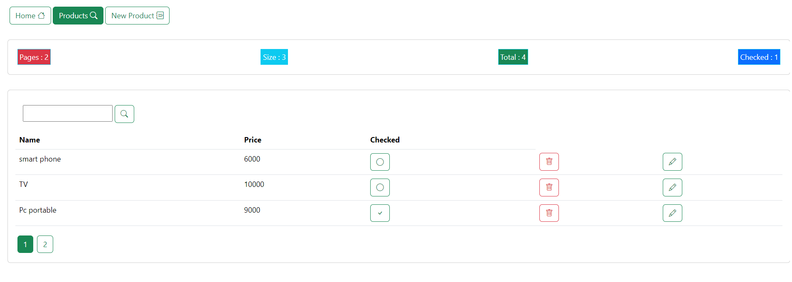
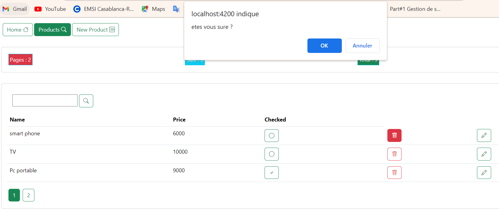

# 
Partie Frontend d'une application Web pour gérer des produits 

***
**Créer une application web basée sur Angular qui permet de gérer les produits. Chaque Produit est défini par son id, name, price, quantity, available. 
Le backend de l'application est basé sur une REST API basée sur Json-Server.**
***
L'application satisfait les exigences suivantes :
<ul><li>
Présentation des produits : Affichage de la liste des produits.
</li>
<li>
Recherche de produits : Possibilité de rechercher des produits spécifiques.
</li>
<li>
Pagination : Mise en place d'une pagination pour une navigation aisée dans la liste des produits.
</li>
<li>Suppression de produits : Fonctionnalité permettant de supprimer un produit.
</li>
<li>
Mise à jour de produits : Actualisation des informations d'un produit dans la base de données.
</li>
<li>
Authentification et protection des routes : Mise en œuvre d'un système d'authentification pour sécuriser l'accès aux différentes fonctionnalités et routes de l'application.
</li>
</ul>

***
# New Product
- [ ] Cette section offre la possibilité d'intégrer de nouveaux produits à l'application. Un formulaire est fourni, englobant des champs essentiels tels que le nom et le prix. Des mécanismes de validation sont mis en place sur ces champs pour assurer la précision des informations saisies. L'utilisateur a la capacité d'enregistrer le nouveau produit en activant le bouton "Save".Une fois l'opération réussie, un message de confirmation s'affiche, informant l'utilisateur que le produit a été ajouté avec succès. Cela offre une expérience utilisateur transparente et assure la visibilité des actions réalisées.

# Products
- [ ] Dans la section "Products", tous les produits sont affichés initialement. Cependant, l'utilisateur a également la possibilité de filtrer les produits en utilisant la barre de recherche. Cela signifie que, si l'utilisateur saisit un terme de recherche dans la barre de recherche, seuls les produits correspondant à ce critère seront affichés, offrant ainsi une expérience de navigation plus ciblée et personnalisée.

En plus de l'affichage initial de tous les produits, la section "Products" propose une pagination pour naviguer à travers différentes pages de produits. Elle fournit également des informations complémentaires, notamment le total des produits disponibles et le nombre de produits qui ont été sélectionnés (checker). Cela permet à l'utilisateur de mieux comprendre la taille totale de l'inventaire, de gérer la navigation de manière plus efficace à travers les pages, et de prendre conscience du nombre de produits marqués ou sélectionnés dans l'ensemble.

  Lors de la suppression d'un produit, un message préalable s'affiche, demandant à l'utilisateur de confirmer son intention de supprimer le produit. Ce message préventif vise à éviter toute suppression accidentelle.

